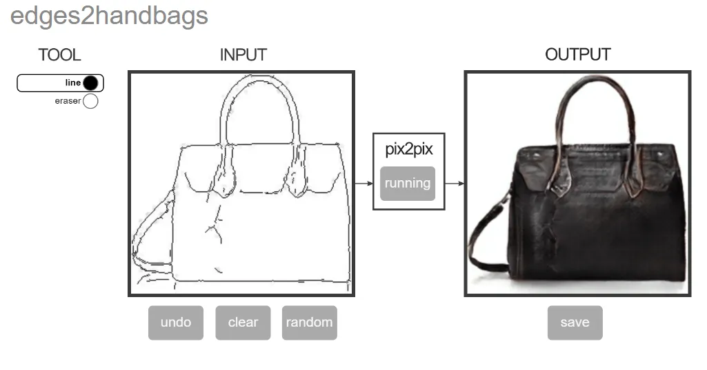

https://becominghuman.ai/some-of-the-recent-advances-in-the-field-of-artificial-intelligence-4057e4fa4afb
Some of the Recent Advancements in the Field of Artificial Intelligence
Nauman Mustafa
Nauman Mustafa

Follow
6 min read
·
Jun 24, 2019
185

If you are looking to build an AI startup or want to see where AI currently stands, this article might be for YOU!

AI needs no introduction. It is all in the news now a days. It is 2019. We are now just waiting for some news like “DeepMind/OpenAI finally developed an AGI” or something like that. This news might come of by any other research group. Some believe AGI might be around the corner and some think we might need a lot more time. Who knows.

While you are waiting for AGI, I have got something for you! I will be sharing a list of recent breakthroughs in the field of AI which are transforming and might have already transformed a huge number of industries!

This list may not be very up-to-date in terms of very recent conferences but it will give you pretty good idea where AI stands today and and in which direction it is going!!! I will be covering mostly topics related to content generation which has huge commercial value but there are a lot more things AI can do.

Text Generation
I do not want to proceed without mentioning OpenAI’s GPT-2 Model which can generate convincingly realistic text. Even though there is a lot of hype and ethical talk around this model, but here is list commercial applications related to text generation:

Fan Fiction Generation: Give model some context and let it build an entire fiction around that, or you can use ideas and continuously guide it to build a story you like within no time! [This Story does not exist](https://www.thisstorydoesnotexist.com/) and [this waifu does not exist](https://www.thiswaifudoesnotexist.net/) are some of the examples.

[This Waifu Does Not Exist](https://www.thiswaifudoesnotexist.net/)

[Content Aggregation](https://paperswithcode.com/paper/language-models-are-unsupervised-multitask): You can use this model to put huge amount of content collected across the internet on your blog. e.g. a single article is usually published across multiple sites, use that context and make the model rewrite that blog for you!
[Automated News Generation](https://www.youtube.com/watch?v=5iZuffHPDAw): Usually a news is built around something that happens on social media. e.g. If Elon Musk tweets something on twitter, there is a huge chance, it will become a news and multiple articles will be written on it. You can use real-time social media data to build automated news generation!
Personalized Articles: We read news articles daily but what if the article you read is personalized to your reading style. This has huge implication e.g. easy vocabulary article for young ones.
[Automated Storylines for Games](https://www.theverge.com/2019/3/6/18222203/video-game-ai-future-procedural-generation-deep-learning): This may sound futuristic, but it may be possible if you train model on a large dataset of a universe e.g. MCU, model might output a custom story-lines and it might be used for totally different game ending for everyone who plays it!
Image Generation
Images represent large portion of the internet. From graphics designers to concepts artists, huge number of people use images to communicate and earn their livelihood.

[Face Generation](https://futurism.com/incredibly-realistic-faces-generated-neural-network): This application may already be disrupting the game industry as you can use it to create realistic faces of non-existent people. You can also use it to create [faces of children and the whole family trees](https://www.youtube.com/watch?v=kSLJriaOumA) very quickly or in real-time based on game store-line. Try out [this person does not exist](https://thispersondoesnotexist.com/).

Pix2Pix

[Sketch to Concept](https://www.theverge.com/2019/3/19/18272602/ai-art-generation-gan-nvidia-doodle-landscapes): This is really interesting for concept artists. As it takes huge amount of time to build and complete a concept but if using this, all you have to do is draw a sketch of concept and let AI give you suggestions for how final concept will look like. Or some people use to [generate website](https://blog.floydhub.com/turning-design-mockups-into-code-with-deep-learning/) or [UI/UX design](https://uizard.io/).
[Anime Face/Eye Generation](https://make.girls.moe/#/): Anime is huge industry in japan but it takes a huge amount of time to design face/eye of a character. Using GANs it is possible to generate large number of them with a click of a button.
[Fashion Transfer](http://vision.cs.utexas.edu/projects/FashionPlus/): This can disrupt or may be doing so the whole fashion industry. You can use your own picture to try on clothes without having to buy them. You can try on multiple makeups so see which will look best for the occasion. Hair styles, hair colors and eye colors can be tried out!
Photography: [Recovering broken image](https://www.youtube.com/watch?v=gg0F5JjKmhA), [noise removal](https://www.youtube.com/watch?v=pp7HdI0-MIo), [super zoom](https://towardsdatascience.com/deep-learning-based-super-resolution-without-using-a-gan-11c9bb5b6cd5) and [night time realistic photo](https://www.youtube.com/watch?v=qWKUFK7MWvg) are some of the breakthroughs that are already being part of modern smartphones. This AI lets you becomes an expert in photo editing in no time.

GauGAN

Audio Generation
Audio is another type of content we consume online on daily basis. Whether it be someone speaking or music from your favorite playlist. Here is a short list of breakthroughs:

[Music Composition & Synthesis](https://magenta.tensorflow.org/): If you have music sheet, you can generate music with the help of lots of instruments but what if AI can help play those instruments. You can go even further by let the AI compose music for you given certain constraints using model like GPT-2. So you can change the music industry forever :D

[MuseNet Demo](https://openai.com/blog/musenet/)

[Speech Synthesis](https://github.com/NVIDIA/waveglow): Realistic speech synthesis has always been a problem but with recent breakthroughs, you can synthesis realistic speech. There is also research on [transferring voice of one person to another](https://futurism.com/this-new-tech-can-copy-anyones-voice-using-just-a-minute-of-audio) or even editing what one person said. Or [translate like a pro](https://venturebeat.com/2019/05/15/googles-translatotron-is-an-end-to-end-model-that-mimics-human-voices/)!
Video/Animation Generation
Video is the most popular type of content consumed in today’s internet. YouTube is famous platform and huge number of YouTubers earn online by producing high quality content.

Video Style Transfer: You can convert one type of video to completely new type of video or if you are an artist or an animator, you can draw [simple annotations and let AI give you some ideas](https://samim.io/p/2018-08-20-video-to-video-synthesis-httpsgithubcomnvidiavid/).
Face Style Transfer: [DeepFakes](https://www.youtube.com/watch?v=dMF2i3A9Lzw) lets you swap face of a person in a video with another person. You can also go beyond deep fakes and swap speech style.
[Realistic Animation](https://www.youtube.com/watch?v=Ul0Gilv5wvY): AI is also good at animating objects. This can be directly used in 3D animation industry to animate complex objects without breaking a sweat. It is also pretty useful in game animations.

Animating objects by capturing them using camera
3D Modelling: GANs can be used to create huge variety of 3d models and it is pretty useful to generate large number of synthetic characters/houses and buildings.
That's it?

Nope, I barely scratched the surface. I didn’t even touch many of the topics like game playing, virtual youtubers, virtual models (may become AI in future), self-driving and a lot more!

Thanks for reading. If you have any suggestions or would like to add something in the list, let me know in the comments.’

Don’t forget to give us your 👏 !

Artificial Intelligence
Machine Learning
Deep Learning
AI
Machine Intelligence
185

Becoming Human: Artificial Intelligence Magazine
Published in Becoming Human: Artificial Intelligence Magazine
39K followers
·
Last published Jan 30, 2025
Latest News, Info and Tutorials on Artificial Intelligence, Machine Learning, Deep Learning, Big Data and what it means for Humanity.

Follow
Nauman Mustafa
Written by Nauman Mustafa
95 followers
·
85 following
Sr. Vibe Coder

Follow
