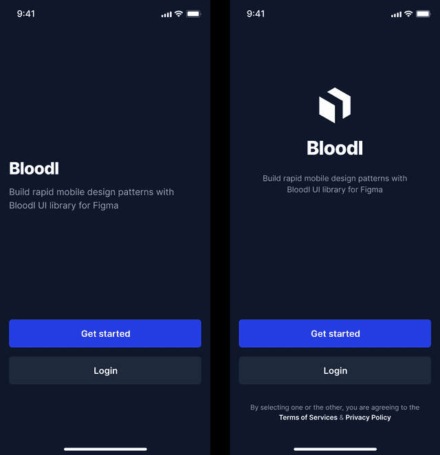
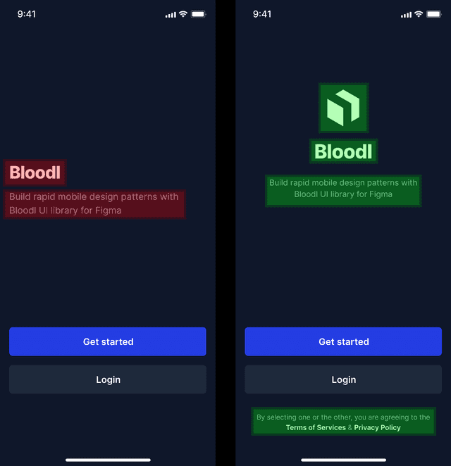
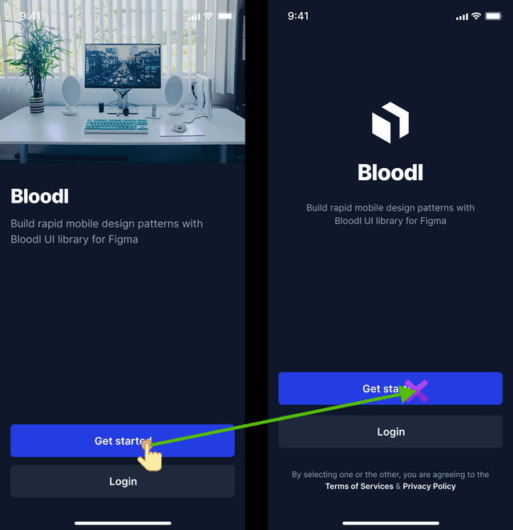
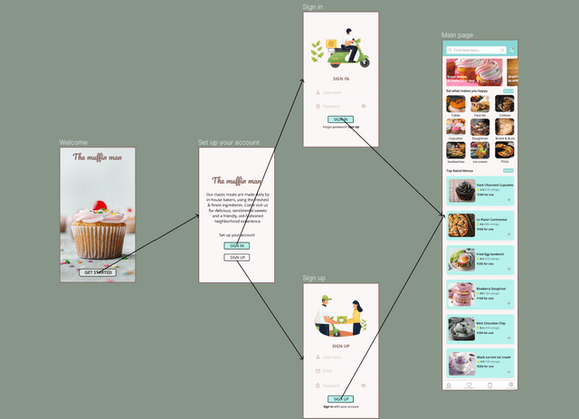

<!-- https://nocode.autify.com/blog/machine-learning-features-in-autify-for-mobile -->
<!-- December 21, 2025 -->

# Machine Learning Features in Autify for Mobile

We at Autify help our customers automate the tedious tasks of quality assurance. And with the launch of Autify for Mobile, We are expanding our product to now include testing mobile apps, along with our current offering of testing web apps. In this article, we want to highlight some machine learning-related features that are currently either in beta or upcoming in Autify for mobile.

## Visual Regression Testing

The first very exciting feature in Autify for Mobile is Visual Regression Testing (or Autify VRT in short). The goal of VRT is to help customers quickly identify visual changes across multiple builds of their apps. These changes include but are not limited to changes in the color, position, style, and layout of objects in the screenshot.

Let us look at the two versions of a sample app:

If we use Autify VRT on these two versions, we can quickly see which things have been removed and which ones have been added. The following comparison shows which objects have been removed from the previous version (left, Red) and which things have been added/replaced in the new version (right, green).

## Visual Self Healing

Visual self-healing is the state-of-the-art algorithm we developed that helps us self-heal test scenarios across different runs. It solely relies on visual information and can easily ignore changes in the underlying structure as long as the visual information is preserved. This system is also unaffected by small visual changes like changes in color, some style, etc.

The following scenario gives an insight into what it does. We have a version of the app on the left, and on the right is another version of the same app. During the recording, the user taps on the specific location on the “Get Started” button. However, in the newer version (right), there are significant changes in the app’s design & layout, and the button has also moved upwards. So our visual self-healing engine automatically heals the scenario by estimating the tap location on the new version.

## Visual App Explorer

This feature is currently in development. Visual App explorer or Autify VAX is an AI-based module that explores the app and all possible corners. The primary goal of this feature is to create a navigation map. It achieves that by navigating the app based on the visual information presented on the screen. It can find and report bugs and crashes in the app. It may also be used to list reachable/unreachable locations in the app. Following is an example of how this feature builds a navigation map:

Thank you very much for reading. If you have any questions or want to get access to these features when available, feel free to reach out to us via demo request page below!

[Request “Autify for Mobile” Demo](https://nocode.autify.com/mobile)
