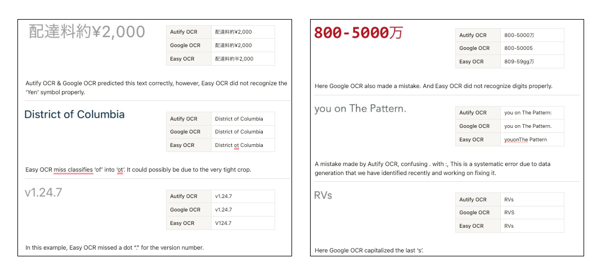
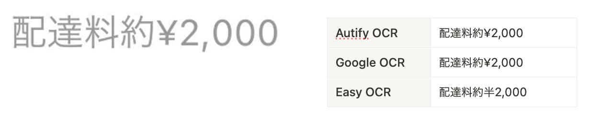
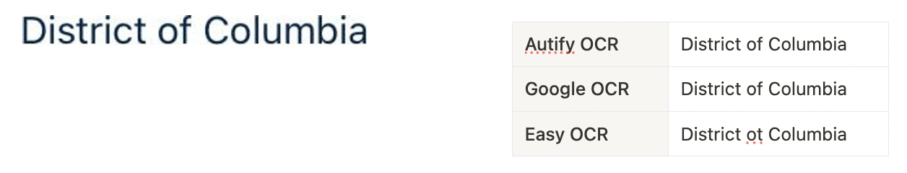

# MLUI Mobile: Autify OCR vs. Google OCR

September 6, 2023
Home
>
Blog
>
MLUI Mobile: Autify OCR vs. Google OCR

Autify for Mobile has multiple ML-based features that are built on top of our ML-based UI detection engine we call MLUI-Mobile. We have integrated an OCR system with this engine that we have developed in-house. While currently, it only powers Mobile features, we are actively working on integrating it with some of the Autify for Web Features. Since our use-case is relatively narrow (i.e. rendered text on screenshots), our in-house OCR system has been able to outperform alternatives available. In this blog post, we want to compare our OCR with open source alternatives like EasyOCR as well as closed source solutions like Google Cloud OCR.

Methodology
Given the specificity of our use-case, we only tested on a chunk of our internal dataset. So the results may differ on other datasets. Also, we gave cropped images of text to all the OCR engines and used our own production detector, so there is a possibility of results being skewed if we were to use each engine’s own detector.

Dataset
We have a few thousand annotated screenshots that contain bounding boxes of texts but this dataset does not contain text annotation. We crop all the text boxes from these screenshots which is ~100k samples. We shuffle this dataset and use OpenAI CLIP to deduplicate samples and take only ~10k. Since, we do not have labels for these boxes, we compare the output of Autify OCR & Google OCR, if the output is similar, we consider it as correct. There is a small probability that both engines are incorrect; however; that is very insignificant.

Results
Initially, we planned to use the agreement of all three OCR engines for ground truth generation which came out to be ~29% of the samples. However; after reviewing the results we realized Easy OCR is making a lot mistakes. As, for the rest of the samples, Easy OCR was agreeing with Autify OCR for ~3% of the samples and with Google OCR for 5% of the samples, but Google OCR and Autify OCR were agreeing for ~45% of the samples.

Thus, we removed Easy OCR’s agreement for ground truth estimation and only relied on Google OCR and Autify OCR. This time we got ~70% of the samples in total agreement for both engines. Next we took ~150 random samples from remaining 30% and annotated in house. And on those samples Autify OCR was 70% of the times correct whereas Google OCR was 30%.

This gives us a final accuracy estimate for Autify OCR as ~91% whereas Google OCR is ~79% accurate.

Analysis ✨
We did some analysis of these results to investigate and rationale some reasons behind these numbers. We found out that one of the core strengths of Autify OCR is handling mixed Japanese & English content. Google OCR was handling English-only and Japanese-only cases very well, some times better than Autify OCR. Another reason Autify OCR performs really well is data domain being limited to only screenshots & rendered texts. We used very strong augmentation scheme while training the model on synthetic dataset which generalizes very well to this use-case.

One reason Google OCR & Easy OCR might not be performing well could be due to the crops of text boxes. We gave pre-annotated crops to each engine instead of using their own detectors. Another reason specifically for Easy OCR is that their pretrained model is optimized for real-world text and lack of rendered text in the training data or breadth of data domain could be the cause of low accuracy on a specific domain.

Samples

Autify OCR & Google OCR predicted this text correctly, however, Easy OCR did not recognize the ‘Yen’ symbol properly.

Easy OCR miss classifies ‘of’ into ‘ot’. It could possibly be due to the very tight crop.

In this example, Easy OCR missed a dot “.” for the version number.

Here Google OCR also made a mistake. And Easy OCR did not recognize digits properly.

A mistake made by Autify OCR, confusing . with :, This is a systematic error due to data generation that we have identified recently and working on fixing it.

Here Google OCR capitalized the last ‘s’.

An example of Korean text, since we only provided ‘en’ and ‘ja’ as the languages to Easy OCR, it tried to match the text with Japanese characters.

Conclusion
For our initial version of MLUI, we did use Easy OCR for a while. However, given the amount of errors, we decided to move to another solution. We also explored Google OCR but the challenge was, we could not improve it when it made mistakes. That is how, we decided to build an extremely optimized in-house solution which is an encoder-decoder transformer trained on massive synthetic dataset and architecture optimized for speed and accuracy trade-off.
