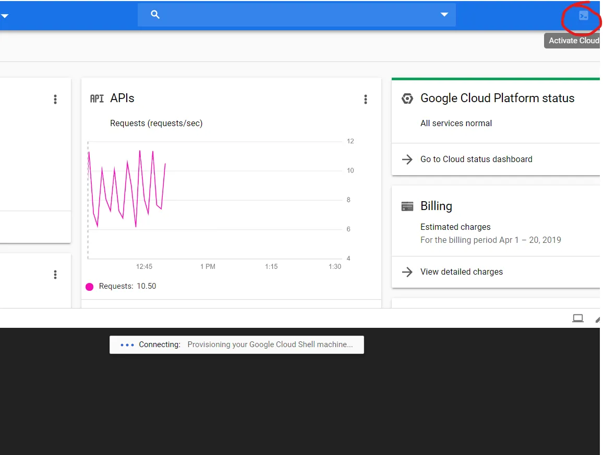
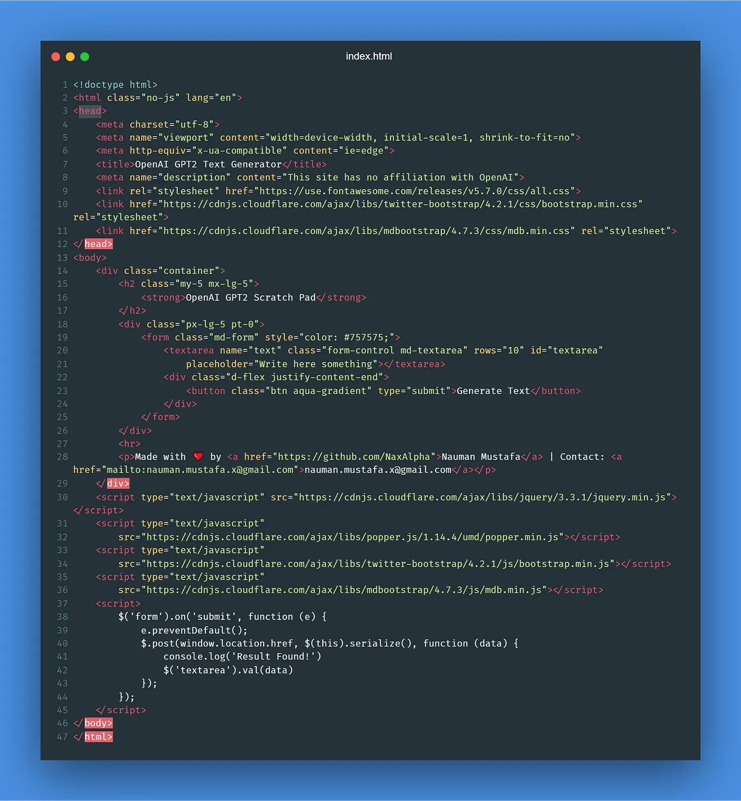
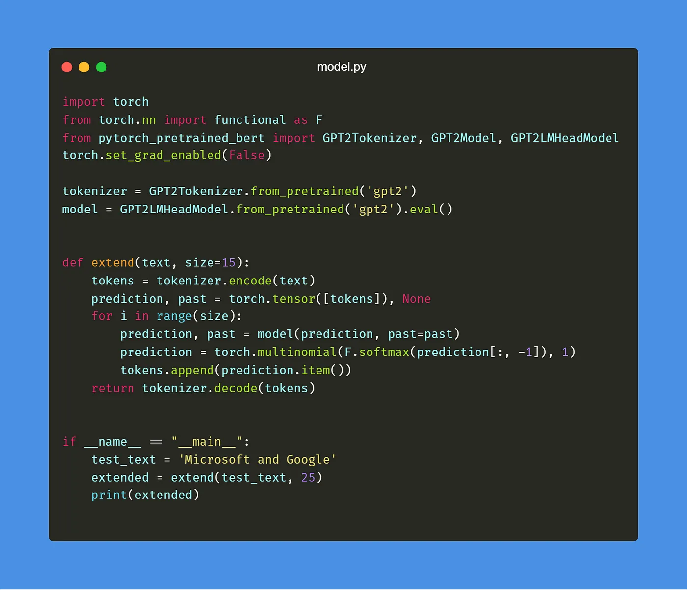
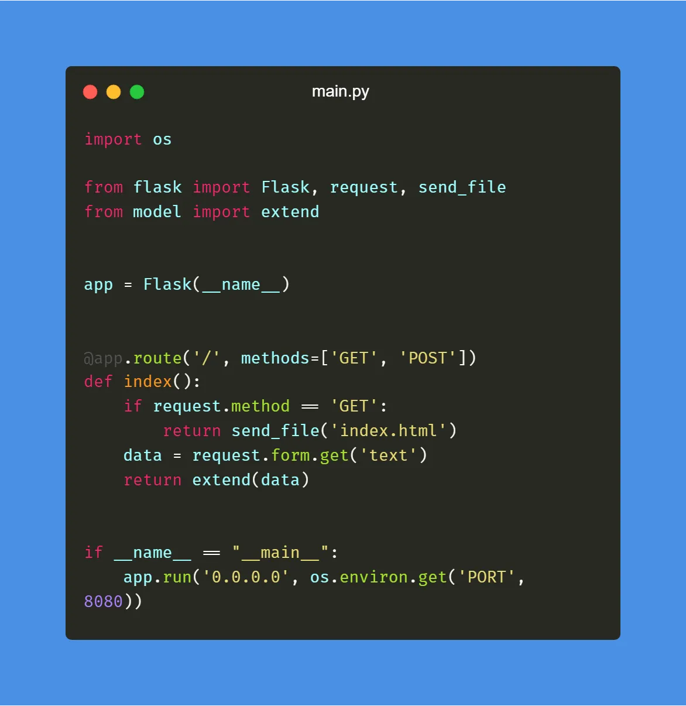
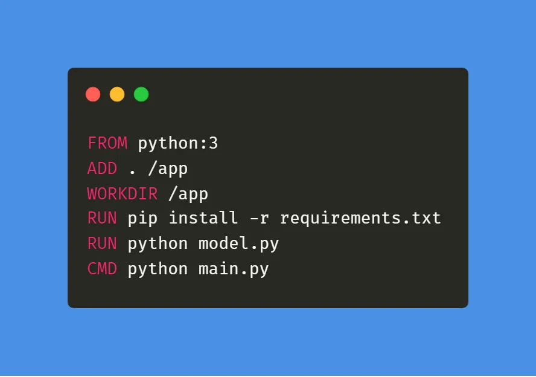
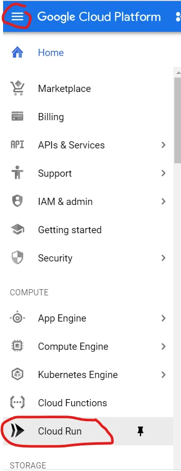
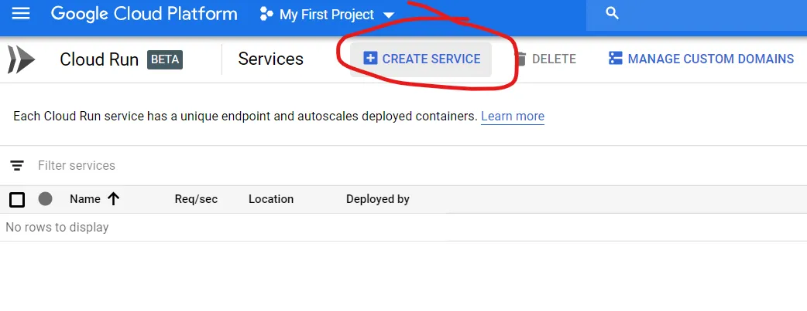
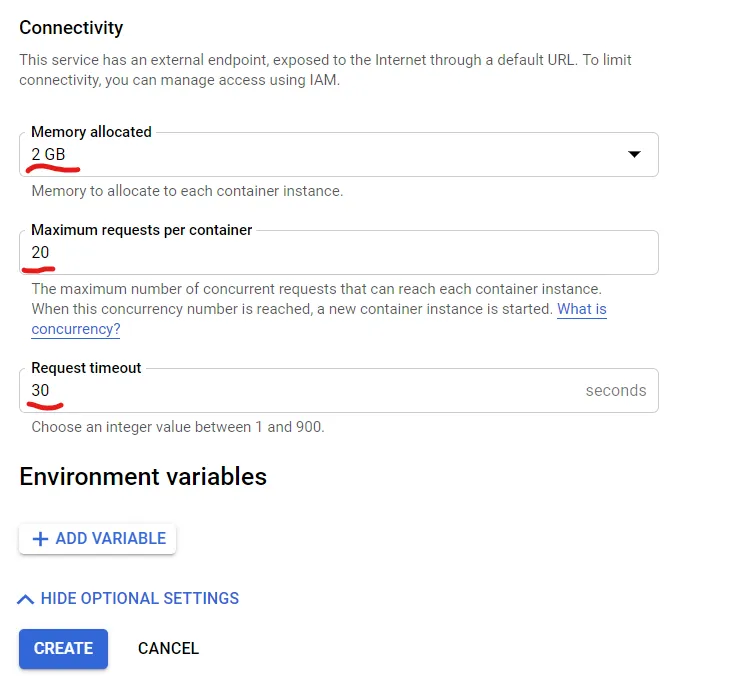
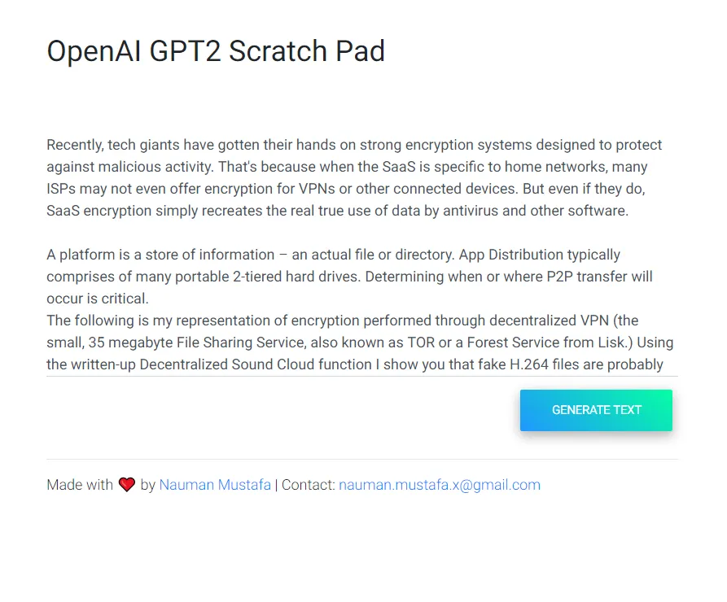
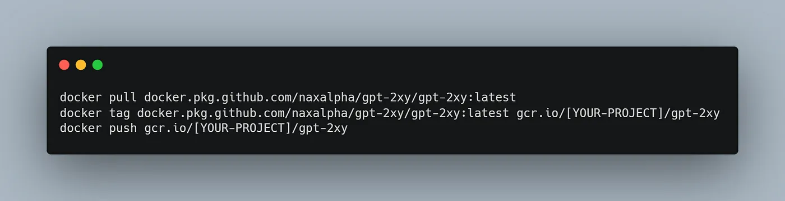

Deploy Machine Learning Model in Google Cloud using Cloud Run
Nauman Mustafa
DataDrivenInvestor
Nauman Mustafa
·
Follow

Published in
DataDrivenInvestor

·
4 min read
·
Apr 20, 2019
426

1

You are a hobbyist Machine Learning developer. You come across tons of exciting news related to artificial intelligence. You followed online tutorials and built something cool. Next, you want to show your creation to the world.

If you have been in this situation, you know there are very less number of options available to you. But this might change in the future. Because Google recently announced changes to its cloud platform.

Cloud Run is one of the most exciting additions to its platform. In this article, we will deploy an open source pre-trained deep learning model on Cloud Run.

If you do not have an active Google Cloud account, you can sign up here. If you are a new user, you will get 300$ free credits for one year. Once ready you can start Cloud Shell.

Start Cloud Shell From Top Right Icon

For the sake of this tutorial, we will use existing deep learning project from GitHub and deploy it to Cloud Run. I created a [sample project](https://github.com/NaxAlpha/gpt-2xy) which uses [HuggingFace’s Pytorch implementation](https://github.com/huggingface/transformers) of GPT-2.

## Into The Code

If you want to deploy to Cloud Run, you can skip this section. Otherwise, you can stick here and see the code in action. index.html contains user interface code.

Minimal Web User Interface for GPT-2

In model.py, I have implemented the logic to extend text using GPT-2 model.

Load and Test Model by Extending Simple Text Phrase

And finally, create a flask server to serve requests (in main.py):

Web Server Code: For User Interface and API to Do the Fun Stuff

You can test it by first installing the following requirements:

Pytorch (CPU version will work just fine)
transformers
flask
Once ready, you can start the server by: python main.py

Next, we need to build a Docker image for our project. So that we can deploy it to Cloud Run. I have created the following Dockerfile which uses python:3 as a base image, installs dependencies and runs our server.

Dockerfile to Deploy to Cloud Run

You can build docker image locally on your system and then push it to Google Cloud. But if you have slow internet, it can take quite some time. So for this step, we will use Cloud Shell.

You will need your project ID for the following steps. To see your project ID in Cloud Shell, use the following command:

gcloud config list — format ‘value(core.project)’ 2>/dev/null

Follow these steps to setup docker image: (make sure to replace [PROJECT_ID] with your cloud project ID.)

Clone Repository: git clone https://github.com/NaxAlpha/gpt-2xy
Go to Source Directory: cd gpt-2xy
Build Docker Image docker build -t gcr.io/[PROJECT_ID]/gpt-2xy .
Configure Docker for Google Cloud: gcloud auth configure-docker
Push image: docker push gcr.io/[PROJECT_ID]/gpt-2xy
And you are all set!

## Deploying to Cloud Run

From the top left icon, go to Cloud Run page

Then click on create service:

Do not forget to enable Allow unauthenticated invocations. And then click on Show Optional Settings.

Next change Memory to 2GB and other settings as following (it is also recommended to set CPUs to 2 which will make it faster):

Click Create and it will take some time, once done you are ready to go.

You can also use domain/subdomain mapping. ~~I have deployed my own version here: https://gpt2.ai-demo.xyz/ and here is a sample~~ (**Edit** *May 2025*: Since it is a pretty old project, I have taken it down. You can still use the code to deploy your own version).:

I just typed Recently, tech giants and rest is written by AI
I hope you enjoyed this tutorial. You can get the full source code here. Let me know if I have any feedback related to my article. Also, stay tuned for future tutorials.

Edit (19–07–2020): Many people reported issues with docker build so I updated the repo to latest version. If you want to skip building docker image, you can use pre built docker image from here. And use the following commands in Google Cloud shell to get your image 
ready:

Google Cloud Platform
Deep Learning
Machine Learning
Cloud Computing
Google Cloud Run
Some rights reserved

426

1

Follow
Nauman Mustafa
Written by Nauman Mustafa
95 followers
·
85 following
MLE @ autify.com

Follow

Responses (1)

Write a response

What are your thoughts?

Cancel
Respond
Carlosiusalazar
Carlosiusalazar

Jun 11, 2020

Hi, I followed guide, used your docker and got this: Cloud Run error: Container failed to start. Failed to start and then listen on the port defined by the PORT environment variable. Logs for this revision might contain more information.

Hide replies

Reply

Nauman Mustafa
Nauman Mustafa

Author
Jul 19, 2020

Hi Carl, I have updated the repo to latest version. You can use the latest docker image from here. i.e.:
docker pull docker.pkg.github.com/naxalpha/gpt-2xy/gpt-2xy:latest
docker tag docker.pkg.github.com/naxalpha/gpt-2xy/gpt-2xy:latest gcr.io/[YOUR-PROJECT]/gpt-2xy
docker push gcr.io/[YOUR-PROJECT]/gpt-2xy
Reply
