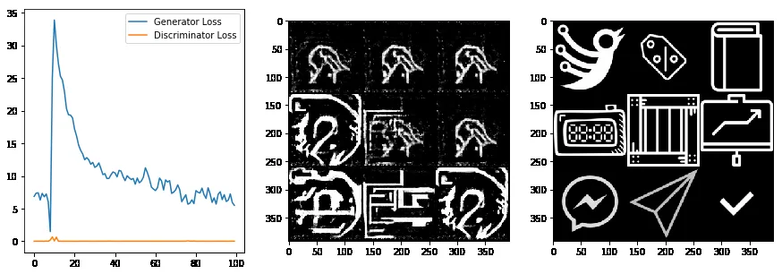

This Icon Does Not Exist — An Application of GANs to Icon Generation
Nauman Mustafa
Nauman Mustafa

Follow
3 min read
·
May 11, 2019
131

1

Generative Adversarial Networks (aka. GANs) are one of the most important type of neural networks. As they provide a direct way to create something new out of the thin air. There is a lot of literature out there which explains GANs from their working in theory to their practical implications.

In this article, I will share my experience of applying GAN to a specific problem. The problem statement is “Given large enough Icons dataset, can a GAN learn its distribution?” GANs are well know to learn the underlying distribution of data. This helps not only to fit the entire dataset in a single neural network but also related data points not present in the dataset.

this*doesnotexist.com is a general trend many people use to display output of GAN for their application. e.g. thispersondoesnotexist.com is website which shows new face generated by a GAN. Hence the title of this article.

I started off this experiment by implementing vanilla DC GAN and then fitting it to MNIST which worked as expected. Next step was to scrape data around the internet. I wrote some scraping scripts, I was able to scrape around ~1000 different icons of size 512x512. Even though this data is pretty small compared to 60,000 MNIST samples, it should still give a baseline result.

The data I collected was not clean, so I wrote some cleaning scripts and converted icons to mimic MNIST like style:

Sample Icons from the dataset

I used Google Colab for training my network. They (sometime) offer Tesla T4 for free for at max 24 hours (can be interrupted in between). Tesla T4 has comparable performance with RTX 2070. You can use Google Drive to provide storage for Colab. So if you modify your code so that interruptions, jupyter notebook and Google Drive does not affect you, you get a free high performance GPU for training.

Following are snapshots from training (losses in left, output in the middle and ground truth in right):

It started off as expected, trying to pick up some patterns:

Epoch ~ 1
After 10 epochs, it is trying to produce basic patterns:

Epoch ~ 10
After around 50 epochs, it is producing blurry and broken shapes but good progress so far :D

Epoch ~ 40
But around 70 epochs, shapes look like hand drawn icons:

Epoch ~ 70
However, after 500 epochs, generator loss became very high but discriminator loss got almost zero which means discriminator got too good and generator lost this game.

Epoch ~ 700
Thanks for reading this article. This project is work in progress and I will share the update once I have some promising results. In the meantime you can checkout the repository I created for this project. If you have any questions, let me know in the comments.

This post is application supplement in [machine learning](https://www.toptal.com/machine-learning) for toptal application.

<!-- Card -->
NaxAlpha/xgan
A highly customizable implementation of GAN for rapid prototyping using PyTorch - NaxAlpha/xgan
github.com
<!-- End Card -->

Machine Learning
Artificial Intelligence
Deep Learning
Computer Vision
Gans
131

1

Nauman Mustafa
Written by Nauman Mustafa
95 followers
·
85 following
Sr. Vibe Coder

Follow
Responses (1)


Cancel
Respond
Punyajoy saha
Punyajoy saha

May 12, 2019 (edited)

This is really a good idea. The results are going into mode collapse but it is fine for now. I was thinking about an application where we can describe an icon and the GAN will create it. What do you think about it?
3

Hide replies

Reply

Nauman Mustafa
Nauman Mustafa

Author
May 12, 2019

Thanks for insights. I have already a plan in motion to use word embeddings to describe icon as set of keywords and then uses those embeddings to create icon on the fly.
7

Reply
