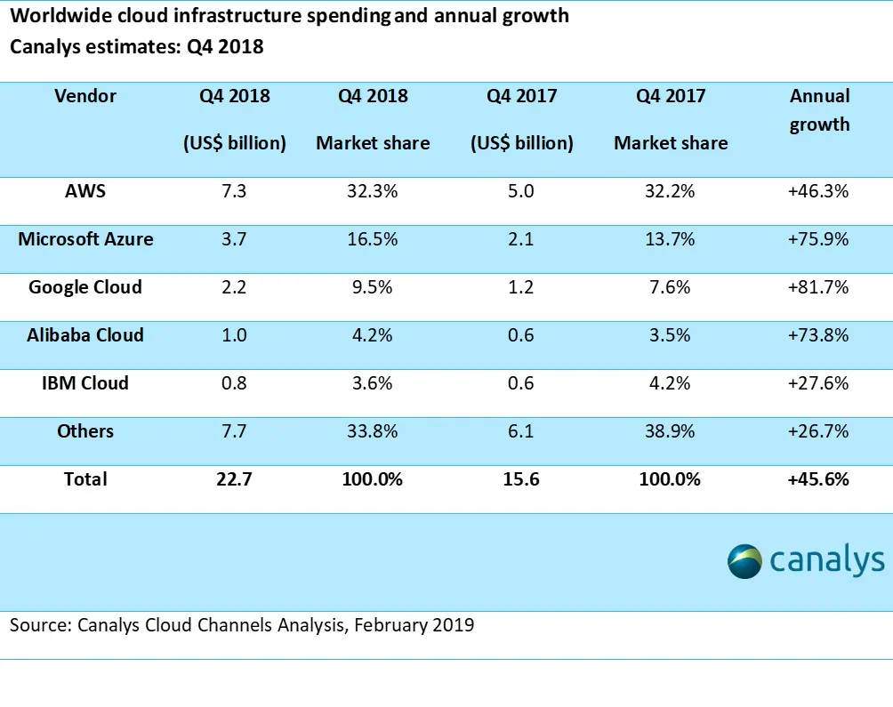
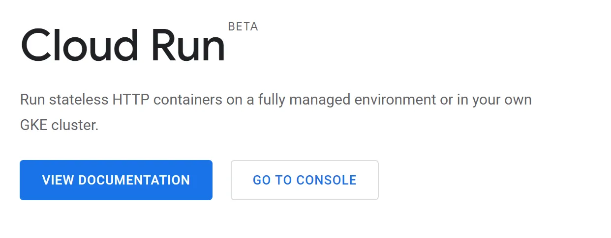

Cloud Run — Future Tech Brought to you by Google
Nauman Mustafa
DataDrivenInvestor
Nauman Mustafa
·
Follow

Published in
DataDrivenInvestor

·
4 min read
·
Apr 14, 2019
110

Google Cloud Platform is one of the leading cloud platforms. It is the fastest growing platform right now. One of the major feature GCP offers compared to other cloud platforms is simplicity. As a developer or a DevOps engineer, all you have, the least steep learning curve. All you have to do is perform a few clicks and you are ready to go, you can do complex configurations later on.

Google Cloud has highest Annual Growth: [Article](https://www.canalys.com/newsroom/cloud-market-share-q4-2018-and-full-year-2018)

Recently Google had its Google Next 2019, where they announced the latest changes to their cloud platform. There are many great services and products to try out. I will be focusing on one of the coolest product they announced: Cloud Run.

Ever since its inception in the form of AWS Lambda, Serverless computing has become a defacto for building microservices which cost you only when you use them. Unlike traditional hosting, where you have to manage always running VMs which scale up and down but cost you 24/7 when running, serverless only costs you, when a user visits your website or your API is called.

Serverless is very popular right now but it has some major caveats. You have to follow the vendor’s rules to configure your project structure. e.g. AWS says you have to structure your project in ABC ways in order for it to be run on AWS Lambda. Same goes for Google and other platforms. And then there is this problem of vendor lock-in, i.e. if you built your application for AWS Lambda, and want to move to GCP, good luck with that. Another problem is Language and Framework support which is certainly limited by each vendor.

On the other hand, containers also have been very popular among people who want to ship their entire application as a single package with all the required dependencies in itself. This provides the flexibility of configuring your own project structure as well as frameworks and libraries. Developers love containers because if it is working on my computer it will certainly work on others’ as well :D. But again, their major problem is that they do not scale down to zero i.e. you will always have something running 24/7.

What if the pros of both serverless and containers are combined? Cloud Run is exactly what I have been looking for a long time. Let me package my application like a container but I also want to pay only when the user uses my container. So basically Cloud Run is serverless container platform.

If you use Python and built a web server using Flask, you must be hosting it on a server which is running 24/7 whether user visits or not. I tried to shift my Flash app to AWS Lambda, it was quite a hassle to use Chalice instead of Flask.

GCP: [Cloud Run](https://cloud.google.com/run)

But with Cloud Run, all I have to do is package my Flask application as a docker container and duh! It’s running serverless.

Even though Cloud Run is a revolutionary tech for developers, it still has some major problems. One of the major limitations I face is computed resources. Just like any other serverless platform, Cloud Run’s computer resources are very limited.

Another limitation of Cloud Run is, it is stateless. i.e. containers cannot have volumes attached with them. You can use Cloud Run on GKE but that would not be 100% serverless.

Thanks for reading. In this article, I just wanted to highlight the new technology and its comparison with old tech. You can read my article on how to actually use docker to package your existing application and deploy it to Cloud Run here:

Serverless
Cloud
Cloud Computing
Google Cloud Platform
AWS
110

Follow
Nauman Mustafa
Written by Nauman Mustafa
95 followers
·
85 following
Sr. Vibe Coder

Follow

