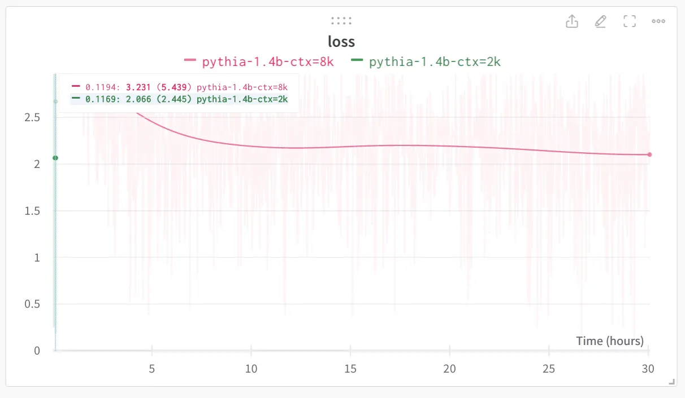

# A quest for very long context: Part 1

## A million or a billion tokens - How far can we go?

> The AI Dude

> Apr 30, 2023

> Orginally published on [Substack](https://naxalpha.substack.com/p/a-quest-for-very-long-context-part)

Since the announcement of GPT4-32k, I have been obsessed with very long sequence length for transformer models. I had [predicted](https://www.linkedin.com/feed/update/urn:li:activity:7022084803038511104/) before the release of GPT-4 that it may have very long context length like 50k or above. While I did not get the number right, I think this is a good direction of the field. A lot of intelligence tasks requiring nuance need huge context and 1024 or 2048 tokens are not sufficient for that.

In this series of essays, I will be sharing some of the techniques I have tried to work towards this goal. My goal was not to ‘try out’ the tricks available in existing literature but rather come up with novel methods so when doing the research or writing this essay, I did not come across any papers related to those techniques. If you know any such works, feel free to drop that in the comments.

Also, these essays are not a very comprehensive academic works with ablation studies etc. Given my limited access to GPUs, I only did a few experiments in each direction and followed the promising directions.

### Discrete Attention

The idea about Discrete Attention came from DiscreteVAE (that openAI used for DALLE-1) where continuous image single in the form of high dimensional latent vectors are converted into discrete tokens. The idea was to convert the embeddings from previous layer into discrete tokens before sending them to attention and then after attention, convert them again into the tokens of same space. This might allow the model to work with symbols in the intermediate layers instead of a very high dimensional continuous space. This allowed me to reduce the embedding size to 256 or 128 as we want to increase the context length so we need to reduce the memory.

However; this did not perform very well. Training an LM from scratch, initially the loss was nan’ing and once fixing the issue, the model converged way slower compared to a continuous domain model. The reason being, limiting the workspace of model to play with made it hard to convergy. I did try increasing vocabulary size and converting to discrete space after QKV but nothing seemed to help.

Since this experiment was a complete failure, I did not incorporate anything from this experiment into future ones.

### Flash Attention

[Flash Attention](https://github.com/HazyResearch/flash-attention) was a major breakthrough for the field of transformers when it was released. It allows linear memory growth for the attention operator which usually requires quadratic memory in relation to the context length.

I put together some simple transformer architectures to test it out and it worked magically. While training from scratch is not a good idea, I could start training for various architectures with a context length of 8k on a single 16GB GPU. Next step was to figure out a way to utilize Flash Attention for a pretrained model

### Long GPT2

You can access the full code for this one [here](https://gist.github.com/NaxAlpha/1c36eaddd03ed102d24372493264694c).

I started with GPT-2. I patched its attention function to use Pytorch 2.0’s flash attention. I also had to increase the size of positional embeddings to allow it to use the large context window. I simply repeated the embeddings N times that fit with the max context length.

I was able to train the smallest GPT-2 with a context length of 8k on 16GB GPU. And as you can see from the loss curve. The model was convergying after seeing 8 billion tokens. Loss is ~4 which may look high but remember it is the smallest GPT-2. For larger models it would be much smaller.

### Long Pythia

Code for this experiment is available [here](https://gist.github.com/NaxAlpha/24e1488db24624656cd6646c2e190f53).

[Pythia](https://github.com/EleutherAI/pythia) is series of models by Eluther AI to understand the scaling laws of transformer models. These are also very competitive models in terms of the benchmarks due to their architecture. By default these models have been trained with a context length of 2k. Also they do not have positional embedding limit due to rotary positional encoding. So I was just able to put longer context without doing anything to start the training.

Along with Flash Attention, I also added [bitsandbytes](https://github.com/TimDettmers/bitsandbytes) for 8-bit training. I was able to fit 1.4b parameter model (which is equivalent to the largest GPT-2 model) with 8k context length on a single A100 (40GB) GPU.

I started the training for 2k context to see the final loss which was around 2.1 as seen from the loss curve. It took around 30 hours of training to reach the same loss. Which means it is much easier to scale these pythia models to longer sequence length.

In summary, I did a variety of experiments to scale the context length of transformers. I think given their unique architecture, Pythia models are well suited for scaling the context length. This also provides as evidence that we can actually train a model on small context length and then later scale the context length to larger window. This has not been previously explored but gradually increasing the context window could be a promising direction to explore. While the max context length I was able to reach was 8k, I think it should be possible to go beyond for larger models with more GPUs like 16xA100s.

Thanks for reading, I hope you enjoyed, stay tuned for future essays in this series.