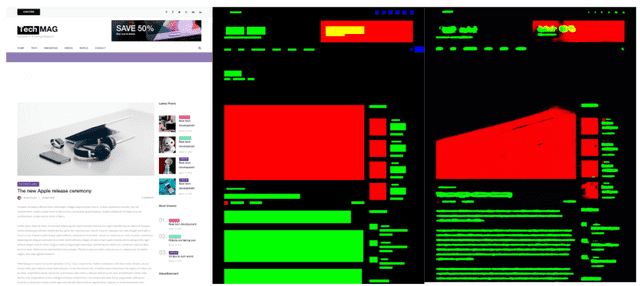

<!-- https://nocode.autify.com/blog/applying-modern-deep-learning-in-autify -->
<!-- January 29, 2021 -->

# Applying modern deep learning in Autify

Deep Learning is at the forefront of modern AI. It is now powering applications that were considered impossible with previous techniques of software engineering. Almost every product is being empowered by techniques from the field. Autify is no exception. We have applied deep learning to multiple aspects of the product. So to share some of the progress, here are some of the upcoming use cases being powered by deep learning.

## Visual Testing Engine

Visual Testing engine is a testing module to visually compare screenshots of different versions of the same web page and find different types of differences. Inspired by Adobe’s FRED, we implement a semantic segmentation model that classifies different regions based on their appearance on the screenshot. The goal is to have a meaningful representation of web screenshots which then can be used to parse out each component and compare them across different versions. This module will be integrated into our upcoming visual testing platform, which will allow users to test their web applications visually.

## Improving Feature Locator

Feature locator generator is one of the core components of our product which performs self-healing of recorded tests across multiple versions of a web application. One of the methods using which it does self-healing is to assign different weights to different features. Early iterations of this engine used human-tuned feature weights, which worked very well but multiple cases are usually found which cause problems.

Since we are optimizing an entire node.js application, we cannot use gradient-based methods from machine learning. Thus we use genetic algorithms to dynamically tune these parameters such that it solves a wider number of problems than a human weight tuner. You should be able to see the results of this improved version in upcoming iterations.

## Deep HTML Representation

HTML is a very powerful and expressive language and the entire web infrastructure is built upon it. However, it is not very friendly to work with HTML in a deep learning context. Here graph neural networks come for the rescue!

In order to calculate useful embeddings of HTML nodes, we extract a lot of numeric and categorical features which include dynamic information computed from selenium (i.e. locations) as well as static information e.g. attributes.

With this information, we were able to successfully classify HTML tags from other features with a validation accuracy of ~45% on our internal dataset of popular websites. We compared its results with a traditional linear model which performed poorly because of a lack of structural information. (Bear in mind that, HTML has a very unequal distribution of classes e.g. a huge number of divs, so we did use classification weight for balanced results).

We also utilized modern tools like mlflow and optuna to perform experiment tracking as well as hyperparameter optimization like the selection of activation function, the number of layers and capacity of the network, etc. This helps us find better models with fewer compute requirements.

## Intelligent Test Discovery

The primary function of Autify is to help users record and maintain tests for their web applications. But what if we could automate the process of recording test cases. Yes, with modern reinforcement learning, it is possible to automatically generate test scenarios of a web application. This is one of the very useful upcoming features of Autify.

## Final Thoughts

In the article, we have shown some of the very promising research projects in Autify. Hopefully, this gets you excited about our product. If you have any questions or queries, reach out to our social media @autifyHQ. Stay tuned for future updates!
