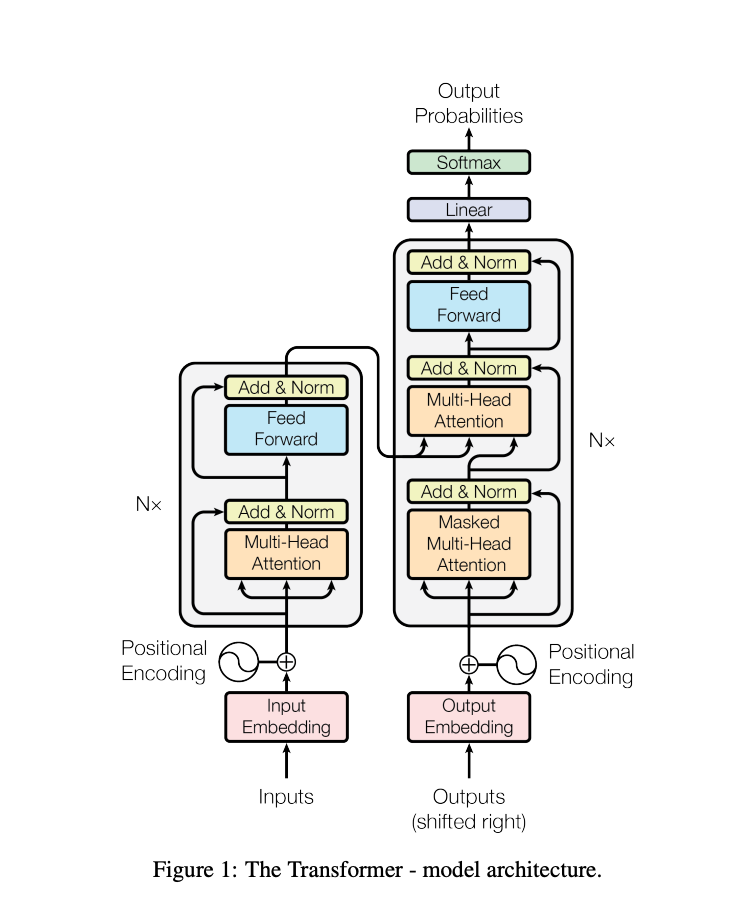

https://www.toptal.com/deep-learning/exploring-pre-trained-models

Getting the Most Out of Pre-trained Models
Getting the Most Out of Pre-trained Models

Pre-trained models are making waves in the deep learning world. Using massive pre-training datasets, these NLP models bring previously unheard-of feats of AI within the reach of app developers.

authors are vetted experts in their fields and write on topics in which they have demonstrated experience. All of our content is peer reviewed and validated by Toptal experts in the same field.
Nauman Mustafa
By
Nauman Mustafa
Verified Expert 
in Engineering
Nauman is currently a senior deep learning engineer at VisionX, with expertise in building deep learning solutions for NLP and CV problems.

Expertise

Deep Learning
Machine Learning
Artificial Intelligence
Previously At

VisionX

Share this article
Most of the new deep learning models being released, [especially in NLP](https://towardsdatascience.com/a-review-of-bert-based-models-4ffdc0f15d58), are very, very large: They have parameters ranging from hundreds of millions to [tens of billions](https://github.com/microsoft/DeepSpeed).

Given good enough architecture, [the larger the model](https://arxiv.org/abs/2001.08361), the more learning capacity it has. Thus, these new models have huge learning capacity and are trained on [very, very large datasets](https://www.tensorflow.org/datasets/catalog/c4).

Because of that, they learn the entire distribution of the datasets they are trained on. One can say that they encode compressed knowledge of these datasets. This allows these models to be used for very interesting applications—the most common one being [transfer learning](https://www.toptal.com/natural-language-processing/accelerate-with-bert-nlp-optimization-models). Transfer learning is fine-tuning pre-trained models on [custom datasets/tasks](https://towardsdatascience.com/a-comprehensive-hands-on-guide-to-transfer-learning-with-real-world-applications-in-deep-learning-212bf3b2f27a), which requires far less data, and models converge very quickly compared to training from scratch.

How Pre-trained Models Are the Algorithms of the Future
Although pre-trained models are also used in computer vision, this article will focus on their cutting-edge use in the [natural language processing](https://www.toptal.com/natural-language-processing) (NLP) domain. [Transformer architecture](http://jalammar.github.io/illustrated-transformer/) is the most common and most powerful architecture that is being used in these models.

The Transformer architecture as presented in Google's 2017 paper, "Attention Is All You Need."

Although [BERT](https://arxiv.org/abs/1810.04805) started the NLP transfer learning revolution, we will explore [GPT-2](https://openai.com/blog/better-language-models/) and [T5](https://github.com/google-research/text-to-text-transfer-transformer) models. These models are pre-trained—fine-tuning them on specific applications will result in much better evaluation metrics, but we will be using them out of the box, i.e., with no fine-tuning.

Pre-trained NLP Models: OpenAI’s GPT-2
GPT-2 created quite a controversy when it was released back in 2019. Since it was [very good at generating text](https://techcrunch.com/2019/02/17/openai-text-generator-dangerous/), it attracted quite the [media attention](https://www.theguardian.com/technology/2019/feb/14/elon-musk-backed-ai-writes-convincing-news-fiction) and raised a lot of questions regarding the future of AI.

Trained on 40 GB of textual data, GPT-2 is a [very large model](https://openai.com/blog/gpt-2-1-5b-release/) containing a **massive amount of compressed knowledge** from a cross-section of the internet.

GPT-2 has a lot of [potential use cases](https://github.com/openai/gpt-2/issues/155). It can be used to predict the probability of a sentence. This, in turn, can be used for text autocorrection. Next, word prediction can be directly used [to build an autocomplete component](https://www.tabnine.com/blog/autocomplete-productivity/) for an IDE (like Visual Studio Code or PyCharm) for writing code as well as [general text writing](https://transformer.huggingface.co/). We will use it for automatic text generation, and a large corpus of text can be used for natural language analysis.

Text Generation
The ability of a pre-trained model like GPT-2 to [generate coherent text](https://www.analyticsvidhya.com/blog/2019/07/openai-gpt2-text-generator-python/) is very impressive. We can give it a prefix text and ask it to generate the next word, phrase, or sentence.

An example use case is generating a product reviews dataset to see which type of words are generally used in positive reviews versus negative reviews.

Let’s look at some examples, starting with what we get if we start with the positive prefix, “Really liked this movie!”

Sample 1	Loved the character’s emotions at being in constant danger, and how his inner fears were slowly overcome by these events. Also loved that he is so focused on surviving; even for a while it felt like something out of Batman v Superman was showing up every now again because you always knew your enemy would show up eventually anyways :) The ending theme really stuck with me too… I mean yeah they did have to…
Sample 2	It did exactly what I wanted it to do, just a lot of fun. The cast was awesome and the story makes sense so far after seeing everything else already on IMDB. There are hints about being in an underground city from time immemorial due their “power” (or lack thereof) but they don’t really tell that much…I think its more like one big mystery then some other aspects coming together with me for now though….It’s supposed…
As you can see, the word review was not anywhere in the prefix, but as most reviews are titles followed by the body of the review, this forced the model to adapt to that distribution. Also notice the reference to Batman v Superman.

Let’s see another example. Instead of a movie review, we’ll try to generate a product review using the negative prefix, “A trash product! Do not buy.”

Sample 1	And please, do NOT try to use this as a fertilizer for your gardens or lawns – it will cause some serious water damage if ingested by fish and birds. Use with caution because of the possibility that pesticides may be present in pet foods available online at organic grocery stores such too “good” names like Petsmart, PetSmart & Safeway.How toxic is food waste? Waste products can contribute significant amounts - enough so that even very…
Sample 2	No one will give you a piece of that garbage ever again. Just do yourself and your business a favor and clean up before buying it for nothing more than to save some money or convenience in the future.1/2 oz Bottle Plastic Food Storage Packaging + 1 pack #1636370105702615 (P, 3ml) $7 Buy Now You can purchase these bottles at any retail stores but here is how to get…
Again, the prefix can be inferred as the title of a product review, so the model starts generating text following that pattern. GPT-2 can generate any type of text like this.

~~A Google Colab notebook is ready to be used for experiments, as is the “Write With Transformer” live demo.~~ (Edit May 2025: These links are broken)

Question Answering
Yes, since GPT-2 is trained on the web, it “knows” a lot of human knowledge that has been published online up till 2019. It can work for contextual questions as well, but we will have to follow the explicit format of “Question: X, Answer:” before letting it attempt to autocomplete. But if we force the model to answer our question, it may output a pretty vague answer. Here’s what happens trying to force it to answer open-ended questions to test its knowledge:

Sample 1	Question: Who invented the theory of evolution?
Answer: The theory of evolution was first proposed by Charles Darwin in 1859.
Sample 2	Question: How many teeth do humans have?
Answer: Humans have 21 teeth.
As we can see, the pre-trained model gave a pretty detailed answer to the first question. For the second, it tried its best, but it does not compare with Google Search.

It’s clear that GPT-2 has huge potential. Fine-tuning it, it can be used for the above-mentioned examples with much higher accuracy. But even the pre-trained GPT-2 we are evaluating is still not that bad.

Pre-trained NLP Models: Google’s T5
[Google’s T5](https://medium.com/syncedreview/google-t5-explores-the-limits-of-transfer-learning-a87afbf2615b) is one of the most advanced natural language models to date. It builds on top of previous work on Transformer models in general. Unlike BERT, which had only encoder blocks, and GPT-2, which had only decoder blocks, T5 uses both.

T5 inputs and outputs. 1) "translate English to German: That is good," becomes "Das ist gut." 2) "cola sentence: The course is jumping well," becomes "not acceptable." 3) "stsb sentence1: The rhino grazed on the grass. sentence2: A rhino is grazing in a field," becomes "3.8." 4) "summarize: state authorities dispatched emergency crews tuesday to survey the damage after an onslaught of severe weather in mississippi…" becomes "six people hospitalized after a storm in attala county."
GPT-2 being trained on 40 GB of text data was already impressive, but T5 was trained on a 7 TB dataset. Even though it was trained for a very, very large number of iterations, it could not go through all the text. Although T5 can do [text generation](https://threader.app/thread/1224912629967310848) like GPT-2, we will use it for more interesting business use cases.

Summarization
Let’s start with a simple task: [text summarization](https://paperswithcode.com/task/text-summarization). For those [AI development companies](https://www.toptal.com/services/technology-services/artificial-intelligence-development) wanting to build an app that summarizes a news article, T5 is perfectly suited for the task. For example, giving [this article](https://www.engadget.com/2020-02-08-destiny-2-sword-revamp.html) to T5, here are three different summaries it produced:

V1	destiny 2’s next season, starting march 10, will rework swords . they’ll have recharging energy used to power both heavy attacks and guarding . the valentine’s day event, crimson days, is also happening this month .
V2	bungie has revealed that the next season of destiny 2 will dramatically rework swords . the studio has mostly been coy about what the season will entail . the rethink will let swords partly bypass ai enemies’ shields .
V3	destiny 2’s next season will rework swords and let them bypass ai enemies’ shields . the season starts march 10th . you can play destiny 2 during crimson days, a valentine’s day event .
As we can see, it has done a pretty nifty job of summarizing the article. Also, each summary is different from the others.

Summarizing using pre-trained models has huge potential applications. One interesting use case could be to generate a summary of every article automatically and put that at the start for readers who just want a synopsis. It could be taken further by personalizing the summary for each user. For example, if some users have smaller vocabularies, they could be served a summary with less complicated word choices. This is a very simple example, yet it demonstrates the power of this model.

Another interesting use case could be to use such summaries in the SEO of a website. Although T5 can be trained to generate very high-quality SEO automatically, using a summary might help out of the box, without retraining the model.

Reading Comprehension
T5 can also be used for [reading comprehension](https://paperswithcode.com/task/reading-comprehension), e.g., answering questions from a given context. This application has very interesting use cases we will see later. But let’s start with a few examples:

Question	Who invented the theory of evolution?
Context
([Encyclopædia Britannica](https://www.britannica.com/science/evolution-scientific-theory/History-of-evolutionary-theory))	The discovery of fossil bones from large extinct mammals in Argentina and the observation of numerous species of finches in the Galapagos Islands were among the events credited with stimulating Darwin’s interest in how species originate. In 1859 he published On the Origin of Species by Means of Natural Selection, a treatise establishing the theory of evolution and, most important, the role of natural selection in determining its course.
Answer	darwin
There is no explicit mention that Darwin invented the theory, but the model used its existing knowledge along with some context to reach the right conclusion.

How about a very small context?

Question	Where did we go?
Context	On my birthday, we decided to visit the northern areas of Pakistan. It was really fun.
Answer	northern areas of pakistan
Okay, that was pretty easy. How about a philosophical question?

Question	What is the meaning of life?
Context
([Wikipedia](https://en.wikipedia.org/wiki/Meaning_of_life))	The meaning of life as we perceive it is derived from philosophical and religious contemplation of, and scientific inquiries about existence, social ties, consciousness, and happiness. Many other issues are also involved, such as symbolic meaning, ontology, value, purpose, ethics, good and evil, free will, the existence of one or multiple gods, conceptions of God, the soul, and the afterlife. Scientific contributions focus primarily on describing related empirical facts about the universe, exploring the context and parameters concerning the “how” of life.
Answer	philosophical and religious contemplation of, and scientific inquiries about existence, social ties, consciousness, and happiness
Although we know the answer to this question is very complicated, T5 tried to come up with a very close, yet sensible answer. Kudos!

Let us take it further. Let’s ask a few questions using the previously mentioned Engadget article as the context.

Question	What is this about?
Answer	destiny 2 will dramatically rework
Question	When can we expect this update?
Answer	march 10th
As you can see, the contextual question answering of T5 is very good. One business use case could be to build a contextual chatbot for websites that answers queries relevant to the current page.

Another use case could be to search for some information from documents, e.g., ask questions like, “Is it a breach of contract to use a company laptop for a personal project?” using a legal document as context. Although T5 has its limits, it is pretty well-suited for this type of task.

Readers may wonder, Why not use specialized models for each task? It’s a good point: The accuracy would be much higher and the deployment cost of specialized models would be much lower than T5’s pre-trained NLP model. But the beauty of T5 is precisely that it is “one model to rule them all,” i.e., you can use one pre-trained model for [almost any NLP task](https://paperswithcode.com/paper/exploring-the-limits-of-transfer-learning). Plus, we want to use these models out of the box, without retraining or fine-tuning. So for developers creating an app that summarizes different articles, as well as an app that does contextual question answering, the same T5 model can do both of them.

Pre-trained Models: The Deep Learning Models That Will Soon Be Ubiquitous
In this article, we explored pre-trained models and how to use them out of the box for different business use cases. Just like a classical sorting algorithm is used almost everywhere for sorting problems, these pre-trained models will be used as standard algorithms. It’s pretty clear that what we explored was just scratching the surface of NLP applications, and there is a lot more that can be done by these models.

Pre-trained deep learning models like StyleGAN-2 and DeepLabv3 can power, in a similar fashion, applications of computer vision. I hope you enjoyed this article and look forward to hearing your comments below.

Understanding the basics
What is pre-training?
Pre-training is a technique where data scientists train a model architecture on a very large dataset. This induces prior knowledge to the model and helps in fine-tuning the model for newer tasks. An example would be training Resnet-50 on ImageNet.

What is a trained model?

What is a deep learning model architecture?

What is a deep learning layer?

What are the weights of a deep learning model?

Nauman Mustafa
View full profile
Nauman Mustafa
Verified Expert 
in Engineering
Islamabad, Pakistan

Member since October 10, 2019

