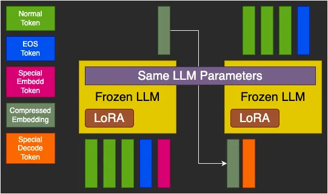
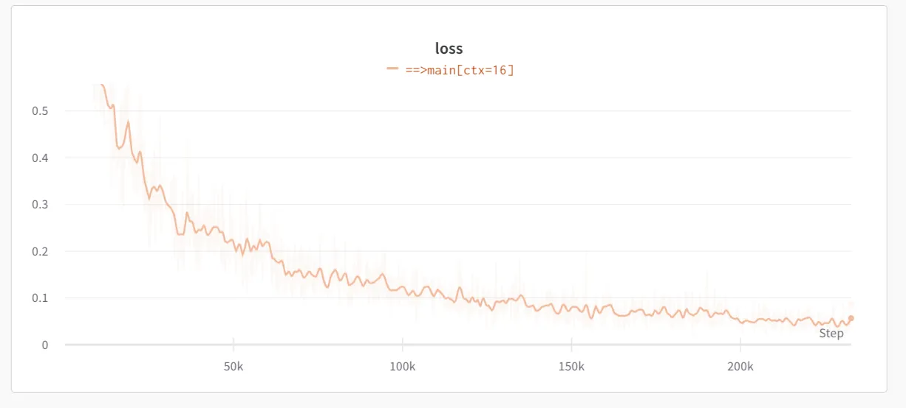
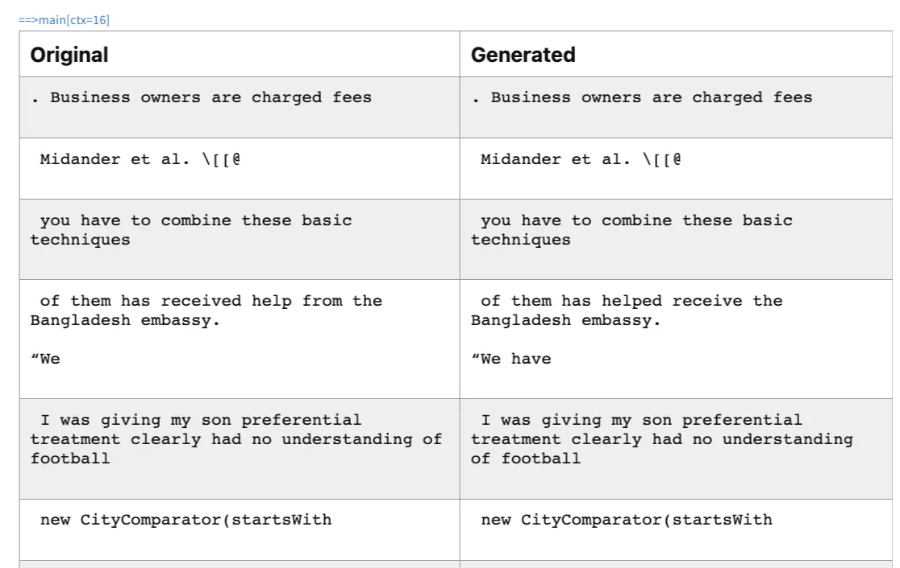
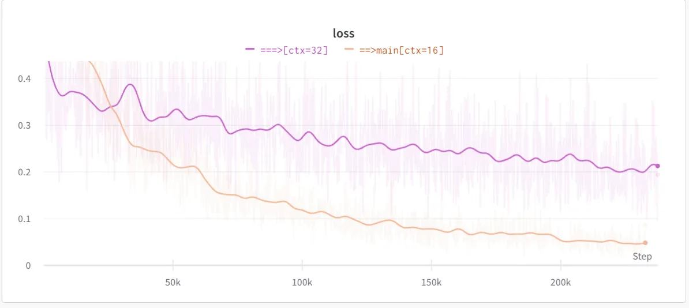

<!-- https://naxalpha.substack.com/p/token-compression-reducing-attention -->

# Token Compression: Reducing Attention Waste?

Using an LLM to compress multiple tokens into one token.
The AI Dude
Aug 11, 2023

LLAMA-7b has a hidden size of 4096. Its vocabulary size is 32k. It needs a vector of size 4096 to represent a token like “is” or even a half word. For LLAMA-2-70b, the hidden size is 8192.

I always wondered if this is just too big to represent just one token. For example, if we look at something like sentence transformer, CLIP text encoder or OpenAI embedding APIs, etc. They seem to compress large amount of text into a single vector. Just to have a perspective, OpenAI embedding API can represent a text with up to 8k tokens with just an embedding size of 1536.

Just to be sure, these text embedders have a different objective compared to let say a transformer. Embedding models are optimized for search-related objectives. And Language models are optimized for next token prediction.

So, I wondered if I could combine this somehow. Can we compress multiple tokens into one token and decode those tokens from that one token? Then we can train a new transformer that operates on these ‘group tokens’ instead of individual ones.

There can be many potential use-cases for such system. Like online knowledge injection, vocabulary extension, and next phrase prediction etc. I leave those exploration to the future work.

The model architecture consists of a frozen LLM with a LoRA attached to it and two additional embedding vectors. LLM weights are frozen but LoRA and embedding vectors are trainable weights. Due to limited compute, I chose Pythia 1.4b as a base LLM which has 2048 hidden dimension.

The forward pass has two stages. First stage is encoding stage that is inspired by [AutoCompress paper](https://github.com/princeton-nlp/AutoCompressors). Text tokens are passed to the LLM with one special <Embed> token which forces the model to compress all the tokens in that single token. Only output at this token is taken out. It is shown as Compressed Embedding in the figure aka context token.

In the second stage, context token along with special <Decode> token is passed to the same LLM which is now trained for next token prediction predicated upon the context. The goal is perfect reconstruction of the input.

The model is parameter efficiently fine-tuned on the pile dataset. Samples from the dataset are broken into chunks of size between 1 to 16 tokens with 1 additional EoS token for every input. The EoS token is a must as we want to know when to stop when decoding a compressed token.

With a batch size of 64, model attains a loss of ~0.05 after ~250k iterations. This loss means almost perfect reconstruction for most of the cases. Here are some example outputs sampled at temperature 0.1 from the system at the final loss:

It shows that a hidden size of ~2048 can easily compress an average of 8 tokens into a single vector. Unlike embedding vectors, this vector can be used for perfect reconstruction of the input text.

Next step was to investigate how far can I push this. I decided to further fine-tuned this model with token ranges from 1-32 while keeping everything else same.

With a batch size of 32 and after same number of iterations, the final loss was ~0.2 which is 4x that of previous model. It shows that the model is struggling to compress longer context.

From the loss curve, it seems, if I were to let it keep training, it might converge but due to compute limitations, I leave that for future investigation.

Here are some sample generations from this new model:

Summary
This project is continuation of [my previous post on a quest for long context](https://nauman.im/long-pythia/). I tried to work on many ideas like AutoCompress mentioned above but due to the speed of research, I realized it would be a matter of time before someone would train open source long context llms. For example, [this effort](https://huggingface.co/togethercomputer/LLaMA-2-7B-32K) (LLAMA-2-32k) by Together Computers is a really good one. So I decide to explore in different directions.

In this post, I show that hidden size used in transformer models maybe an overkill. I present a simple architecture for converting a pre-trained LLM into token compression model. I also demonstrate that an embedding size 2048 can compress ~8 tokens almost losslessly while lossy compression can be achieved for ~16 tokens.

Future Ideas
Token compression model may not have immediate benefits out of the box. So, I want to share some ideas where and how it may be used. I will also be exploring some of these ideas myself as well.

Firstly, token compression unlocks some insights into how transformers actually work. It shows that internally transformers can compress and decompress various concepts and how much they can compress depends upon this embedding vector dimension. By exploring this further, we can design more efficient architectures that have optimal computation. An example architecture would be a growing transformer where after each layer embedding size is increased.

Next, a transformer with a growing vocabulary can be trained. As shown by AI21 Labs, larger vocabulary can improve both context length as well as quality of output. This direction has many benefits. One of them would be ease of domain adaptation for pre-trained models. Something like an architecture with many different types of compressors for various languages and domains and one universal transformer etc.

Then, an obvious benefit would be massive reduction in decode time. Large transformer predicting group of tokens followed by smaller transformer decoding those groups.

Also, maybe a smaller benefit but we can also increase context length with this approach. Compressing tokens could increase context length by a vector of ~8x.

The challenge with an architecture like this is how to optimally group tokens. One naive method would be just group adjacent tokens of size 8. However; it may fail in some cases like where a lot of difficult information needs to be compressed.

I hope you have enjoyed this essay. [Complete source code](https://gist.github.com/NaxAlpha/0b63348cd19395779cd4b021888c2fb4) with model wights is available on github gist. While it is a bit messy, I plan to share a cleaner repo later.
