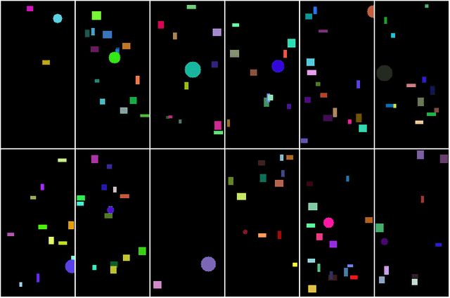
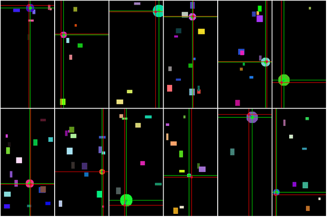
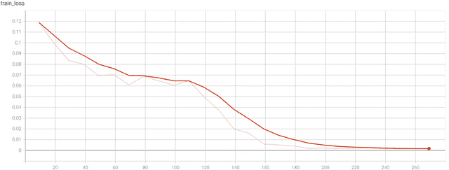
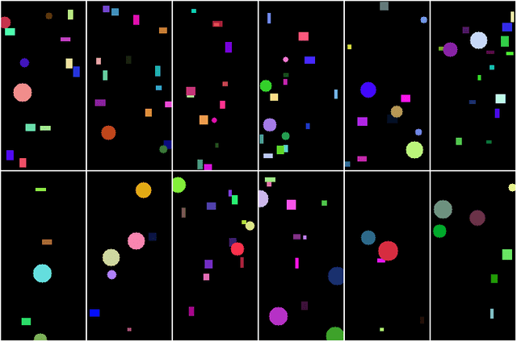
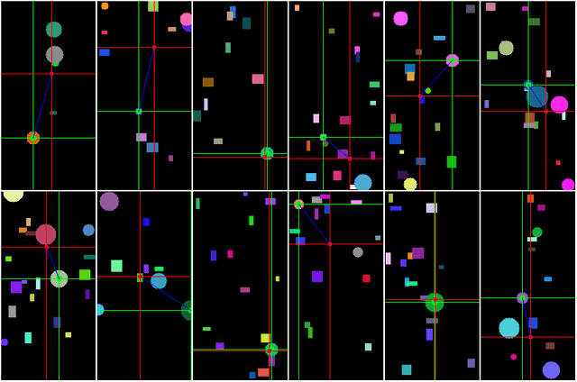
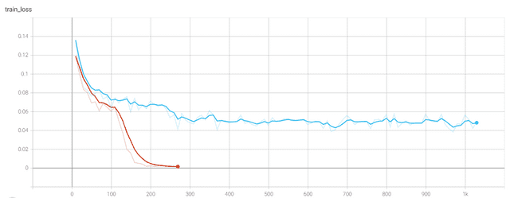
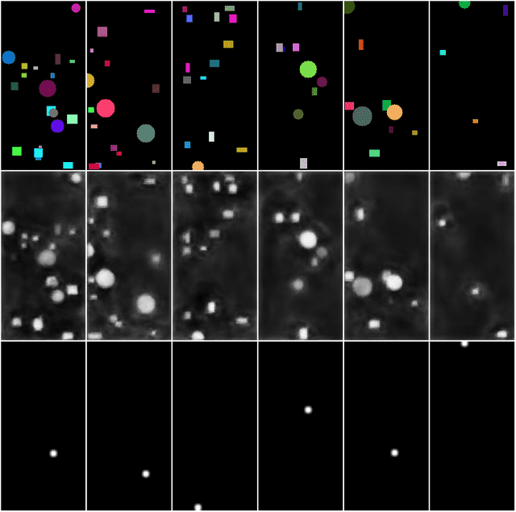
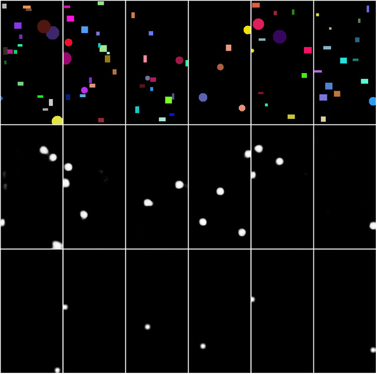
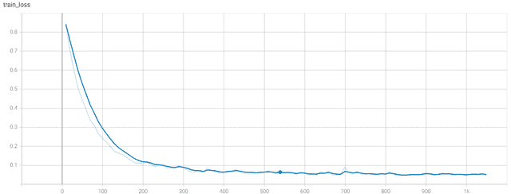
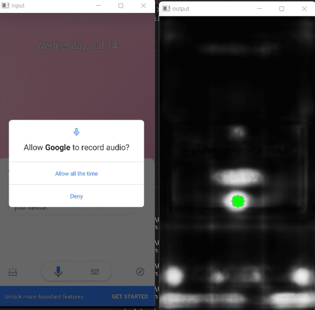

<!-- https://nocode.autify.com/blog/solving-automated-app-navigation-a-use-case -->
<!-- July 25, 2021 -->

# Solving Automated App Navigation: A Use-case

## Introduction

We at Autify solve a lot of pain points for our customers. One of the core components of our product is to help customers record, manage and periodically test user scenarios of their web and mobile applications. With the recent success of AI in automating the very process of automation, we have been trying to accelerate recording user scenarios using reinforcement learning – internally called scenario generation. The goal is to intelligently navigate through the app and find all the possible user flows and potential bugs along the way.

In this article, we will show how we tried different techniques for behavior cloning. Behavior cloning is a very simple form of reinforcement learning where an AI system learns to mimic or clone the behavior of an expert. In our case, a human navigates through different app screens, and this is then fed to a behavior cloning system to mimic the behavior.

To accelerate experimentation and development, we created a toy environment that mimics some aspects of the complexity of the main problem. In this article, we will primarily use this toy environment to model the original problem as well as try to solve it.

We model our problem as predicting tap location on the screen. So, the primary objective is to click/tap on different locations to navigate to new screens. We needed to figure out which neural network architecture can predict x, y coordinates directly from the image. While the input may be much more complex for the real problem, like press and hold or drag, we use only tapping to simplify the problem. This article will go into some of the technical details on how we solved this problem of predicting coordinates from images.

## The Toy Problem

Imagine a game where we have to click on the circle out of so many other shapes. This is exactly what the toy environment represents. Each image is like a mobile screenshot where we have to click on the circle. Let look at some of the images from the toy environment.

This environment generates a random number of random-sized and random colored rectangles and places only one circle. And the goal of the model is to predict the coordinates of the circle. As you can see, it is sometimes tough to distinguish the circle from the rectangle because of the size and the color variations. Now the goal of the model is not to rely on the color information but rather shape information of the objects and output the coordinate.

Two approaches come to mind when modeling this problem. The first one is to predict a probability/heat map that shows where to click (it outputs an entire image), and the second one is to simply predict x,y as directly from the neural network (regression model: it outputs just two numbers).

## The Regression Model

Assuming there is only one circle to predict (which we will show later that the assumption is not sufficient for the real problem), we decided that predicting the entire heatmap might be overkill. So the fastest route seemed like to go with the regression model. We designed the model to predict the mean and the log of standard deviation for the regression head (not just x,y but also width & height), allowing the model to represent some level of uncertainty. After training for a few iterations, we get excellent predictions using this approach:

In this output, the intersection of green lines is the ground truth (the actual center of the circle), and the intersection of red lines is the coordinate values predicted by the model. As we can see, it is very, very close to the actual output. If we look at the loss curve, we can see it converges very well:

> Note: Since we randomly generate a new image at every step, training loss is the same as validation or testing loss because no two images will ever be the same even in training data.

But when we applied this model to our real problem containing mobile screenshots and their coordinates, it simply failed by overfitting training data and always predicting 0.5,0.5 for the validation data. Further investigation revealed that the toy problem is not sufficiently modeling the true problem. And the assumption we made that there should only be one point to click given a screen is false.

## The Improved Toy Problem

Based on the analysis, we update the toy problem: generation of random sized & random colored rectangles is the same. However, now there can be (minimum 1 but) up to 5 circles on the image simultaneously. And one of them is randomly selected to be the prediction output. Here is sample output from the new environment:

After training the same regression model for this updated toy problem, the model did not converge. Here is the output of this model compared with ground truth:

The loss curve clearly indicates that the model cannot learn further despite running for 4x the iterations. For comparison, the red loss curve is for the previous run when there was only one circle, and blue is for this run:

Comparing this (blue) loss curve with one when training on the real problem was similar; however, in the case of training on the real problem, validation loss started to rise, and the model completely overfitted the data; Thus, training diverged.

We also explored a model with multiple regression output heads to predict multiple output points. We modeled it as the most optimistic loss, i.e., the minimum distance from the output would be considered for the loss. However, this did not converge either.

## A Better Model?

We realized that the regression method could not properly model the required uncertainty for solving this problem. Thus, we switched to predicting heatmap/probability using U²Net. We converted x,y coordinates to a black image with a white circle of a small radius at that location. At the start, the network predicted all the circles and rectangles. Here is an output from early in training:

In this image, the top row shows the generated images, the images in the middle row are the outputs by the model, and the bottom row is the ground truth, i.e., what the model should output. As training progresses, the model learns to distinguish circles from rectangles and outputs only the locations of circles as those are the ones that matter:

As you can see – while we ask the model to predict one of the circles – since the model is unsure which one, it is actually predicting the locations of all circles. This is something extraordinary as the neural network not only predicts the correct output but also filters out the training noise. Thus generalizing far beyond the original objective. Loss curve also indicates model convergence:

> Note: This loss curve cannot be compared to the loss curve of regression models as this is binary cross-entropy loss and previously we used mean squared error loss.

When we applied this model to our main objective of modeling tap locations on mobile screenshots, it did not overfit and generalize very well. Here is a screenshot of the output of our model for an android app (interestingly, the model was trained on iOS screenshots):

## Conclusion

In conclusion, we show that using a smaller and simplified version of a very complex problem can help accelerate the experimentation in machine learning. We also show that bad assumptions can oversimplify the problem and thus fail to model the intended objective. We also demonstrate that a good model which can represent uncertainty should be able to reduce the effect of training noise and overall improve generalization.

Finally, we are working hard on this feature. Stay tuned for future updates. And if you have any questions, feel free to reach out to us on Twitter @AutifyHQ.
