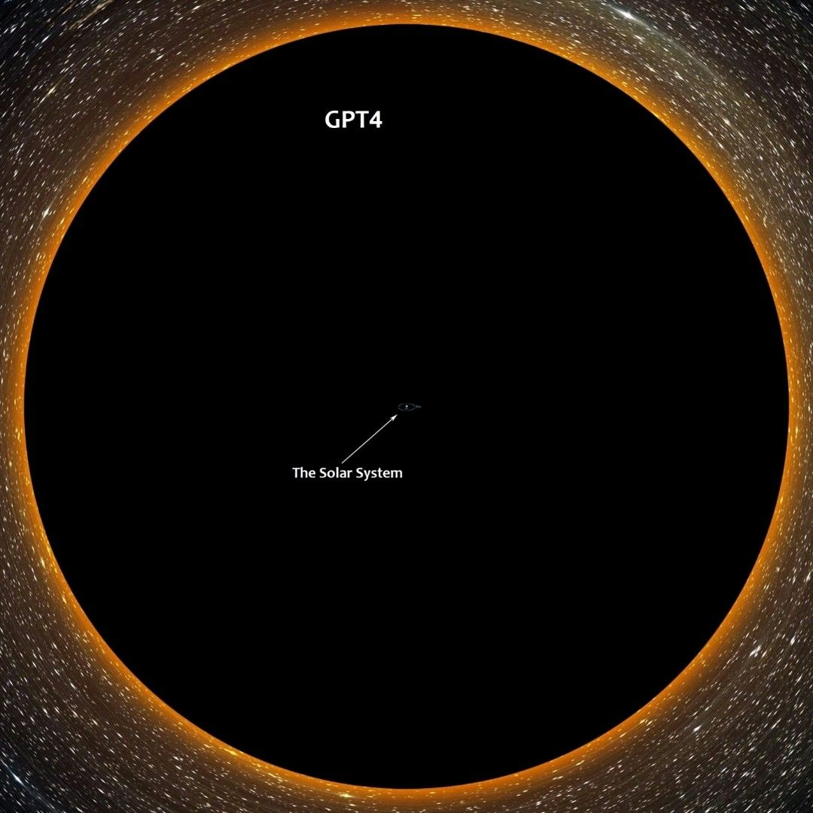

Nauman Mustafa
Nauman MustafaNauman Mustafa
   • 3rd+Verified • 3rd+
Sr. Machine Learning Engineer @ AutifySr. Machine Learning Engineer @ Autify
2yr •  2 years ago • Visible to anyone on or off LinkedIn

Follow

Average GPT-4 rumor in 2023.

On a serious note tho, GPT 4 isn't probably going to be too big compared to GPT-3 as we kind of already have hit the limits of computations. However here are some of the things to expect (this is just my personal opinion based on my knowledge of the field):

0. the size won't be bigger than ~10x at best or more likely it will be just the same size.

1. it may include some optimization tricks from recent research. like longer context, better layers, faster attention, etc.

2. the quality of the data would probably be the biggest factor, there is a possibility they might be training the new model on YouTube video transcripts.

3. multi-modality could be a possibility like GPT directly outputting images along with the text but i see it less probable. More probable is for them to use dalle to synthesize images.

4. there will probably be more specialized versions/experts like chatgpt, along with the core special one i.e. davinci.

5. it will more likely have longer context (currently it has 8k tokens), it might have some sort of memory to increase context way beyond 50k.

hashtag#chatgpt hashtag#gpt3 hashtag#gpt4 hashtag#gpt hashtag#training hashtag#data hashtag#research hashtag#openai
Activate to view larger image,
No alternative text description for this image
Activate to view larger image,
likeinsightfulfunny
29
2 comments
1 repost
Reactions
View Sidhant P Thole’s  graphic link
like
View Hamad Nasir’s  graphic link
like
View Faisal Hussain Sabir’s  graphic link
insightful
View 大橋健’s  graphic link
like
View Tahsin Elahi Navin’s  graphic link
funny
View Farzan Saqib’s  graphic link
like
View Danyal Ali Asghar’s  graphic link
like
View Sam Y.’s  graphic link
like
+21

Like

Comment

Repost

Send
Nauman Mustafa

Add a comment…
Open Emoji Keyboard

Current selected sort order is Most relevant
Most relevant
View Umar Azam’s  graphic link
Umar Azam
   • 3rd+
Systems Integrator at OTTO by Rockwell Automation
2y

Wouldn't a 10x size increase cause a 10x compute+cost increase per query as well ? 

Like
like
1

Reply
1 reply
1 Comment on Umar Azam’s comment
View Nauman Mustafa’s  graphic link
Nauman Mustafa
 
Author
Sr. Machine Learning Engineer @ Autify
2y

yup, usually the relationship is not linear, especially at this scale, the cost per query could go 20 to 50x. 

Like

Reply